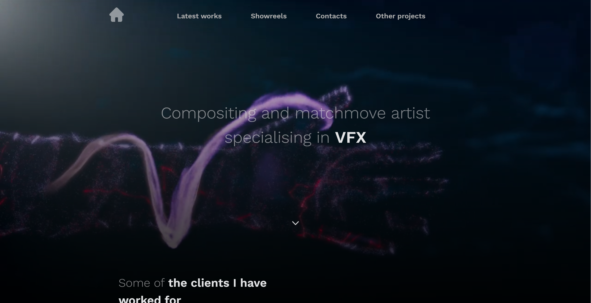
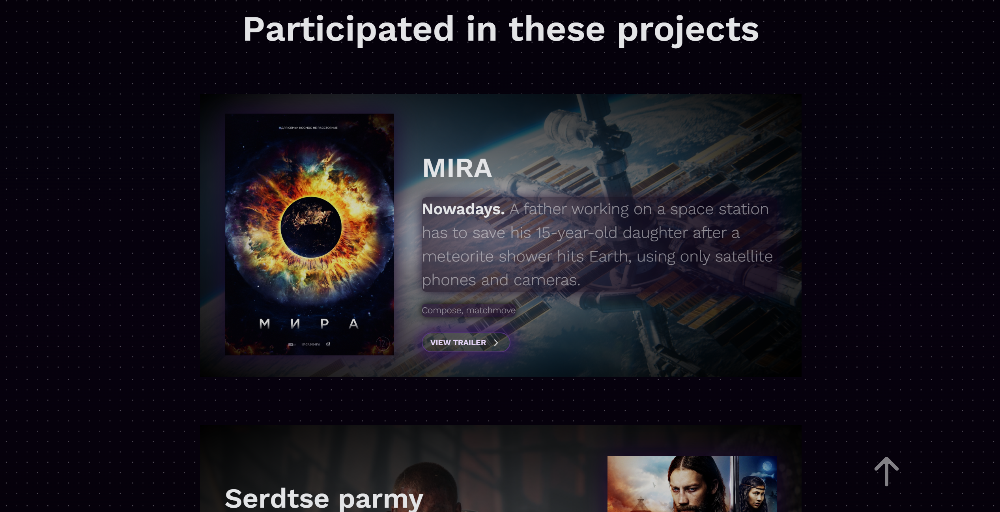
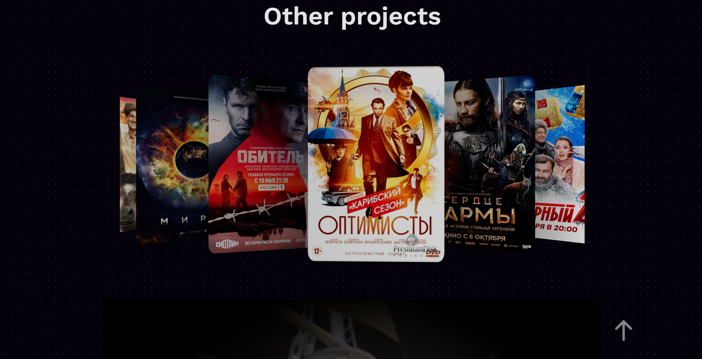
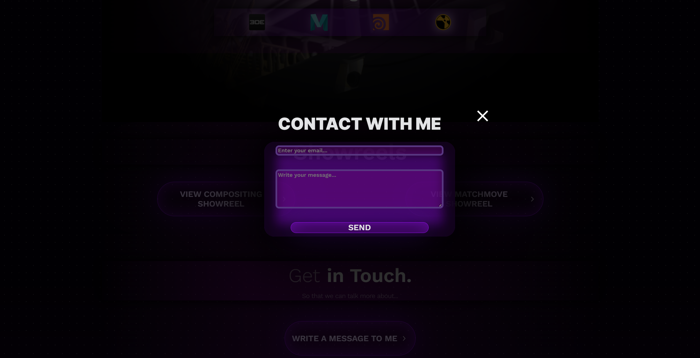

# Project Artist-VFX
___
## Used technologies:
- React
- React-Router
- Swiper
- React-Lazy-Load
___
Project made as a personal SPA, showing the abilities and skills of artist.
There are smooth animations, image-swipers, routing and a form for feedback.
___
To run the project, follow the next steps:
- clone the repo, using the git clone 'repo url'
- then enter the 'npm ci' command
- run the 'npm run start' in the terminal 
- that's it

